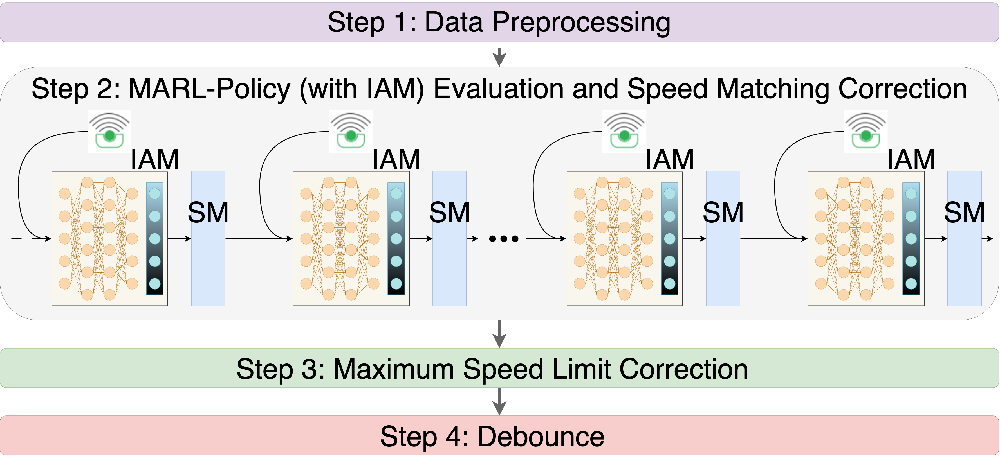

# MARL-Based VSL Controllers


[//]: # ()

This repository provides a field deployed *multi-agent reinforcement learning* (MARL) based *variable speed limit* (VSL) control algorithm. At the core of this algorithm is a MARL-based policy, which was trained and tested in varying simulation environments. We have involved invalid action masking and several safety guards to ensure the real-world constraints. We also released a real-world traffic dataset including the state inputs and the generated control outputs from this MARL-based VSL algorithm during its deployment. We aim to promote the understanding of the MARL-based policy used in this work and to enable refined and smarter control algorithm in near future.

## Installation
```bash
git clone https://github.com/Lab-Work/marl-vsl-controller.git
cd marl-vsl-controller
conda env create -f environment.yml
conda activate marlvsl
```

## Data Structure
dataset/dataset.pkl contains the traffic data recorded by *radar detection system* (RDS) units along with the recorded control outputs from the deployed MARL-based VSL algorithm during the peak hour (5AM-10AM) of Monday, April 22, 2024, on Interstate 24 westbound. The dataset contains the following columns: 
* **time_index**: An integer indicator to represent the time since 5AM. Each unit represents 30 seconds. For example, an integer of 10 represents 5:05AM.
* **mm**: Mile marker of the physical asset, i.e., the VSL controller.
* **down_spd**: One of the input states to the MARL-based policy, i.e., the raw downstream traffic speed.
* **down_occ**: One of the input states to the MARL-based policy, i.e., the raw downstream traffic occupancy.
* **up_spd**: One of the input states to the MARL-based policy, i.e., the raw upstream traffic speed.
* **up_occ**: One of the input states to the MARL-based policy, i.e., the raw upstream traffic occupancy.
* **recorded_pre_action**: One of the input states to the MARL-based policy, i.e., the raw speed limit selected from the preceding (downstream) VSL controller.
* **recorded_policy_output**: The control output (speed limit) generated purely by MARL-based policy.
* **recorded_sm_correction**: The corrected speed limit generated by speed-matching (SM) safety guard.
* **recorded_max_correction**: The corrected speed limit generated by max-speed-limit-correction (MSLC) safety guard.
* **recorded_bounce_correction**: The corrected speed limit generated by debounce safety guard.
* **recorded_final_output**: The final output generated by the control algorithm.

## Reproduce control outputs
The control algorithm is summarized in vsl_controller.py. To reproduce the generated final control outputs, please run `python vsl_controller.py`. This file will extract all state input information first and then go through the RL policy and the subsequent safety guards. A new dataset with control outputs will be generated.